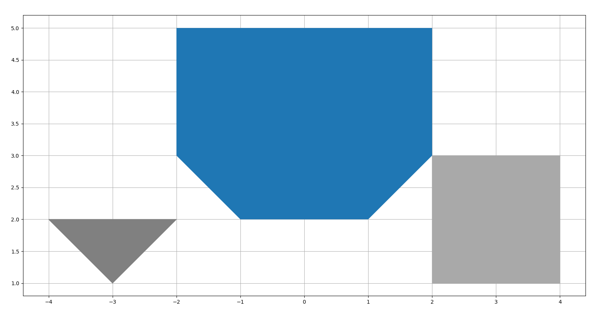
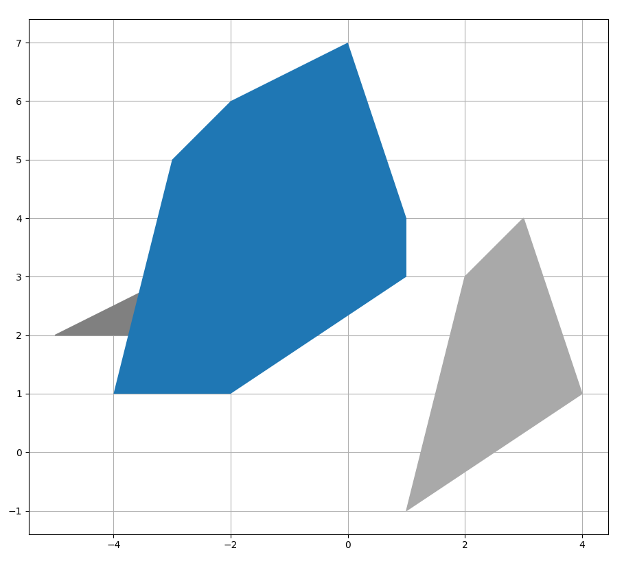

# Minkowski sum
Calculation of Minkowski sum for two convex polygons in 2R space.

Often used to determine collision detection in path planning algorithms with robots of non-circular footprint.
Written in python.

Heavily based on this article: [Minkowski sum of convex polygons](https://vnspoj.github.io/wiki/geometry/minkowski).

